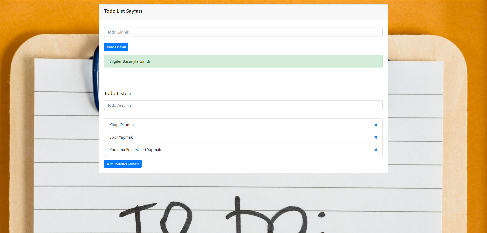

# To-Do List Uygulaması
Bu projede, kullanıcıların yapılacak görevlerini ekleyip düzenleyebilecekleri, basit ve işlevsel bir To-Do List uygulaması geliştirdim. Uygulama, görev ekleme, görevleri silme ve tüm görevleri temizleme gibi temel işlevleri içeriyor. Ayrıca, yerel depolama (localStorage) kullanarak sayfa yenilense bile kullanıcı görevlerini saklayabilme özelliğine sahip. Bootstrap ile tasarlanan bu uygulama, kullanıcı dostu bir arayüze sahiptir.

Özellikler:
- Görev ekleme ve görev silme
- Tüm görevleri temizleme
- Yerel depolama ile görevlerin saklanması
- Görev arama (filtreleme) özelliği
- Uygulamanın sade ve şık tasarımı

Teknolojiler:
* HTML5
* CSS (Bootstrap)
* JavaScript

